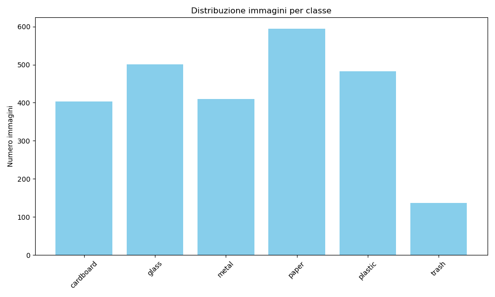
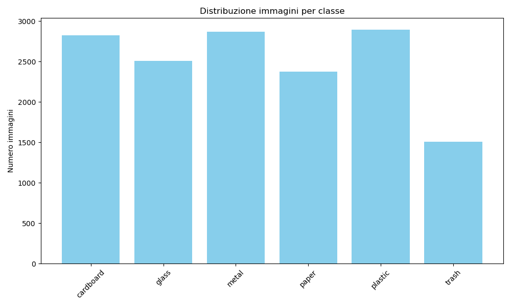
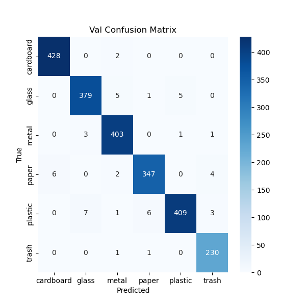
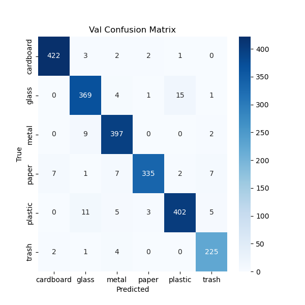
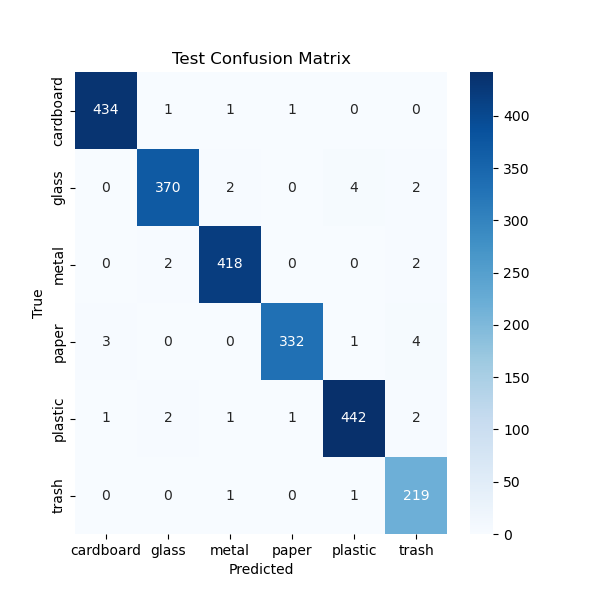
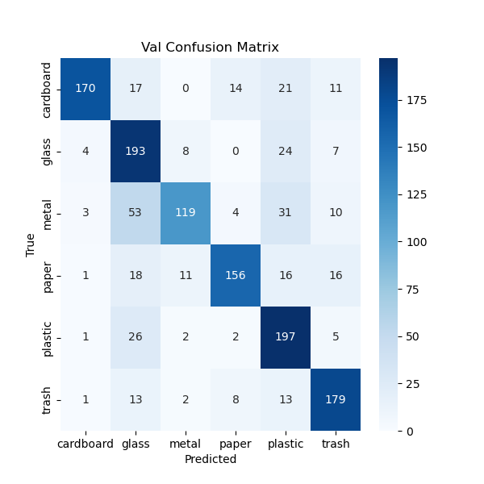
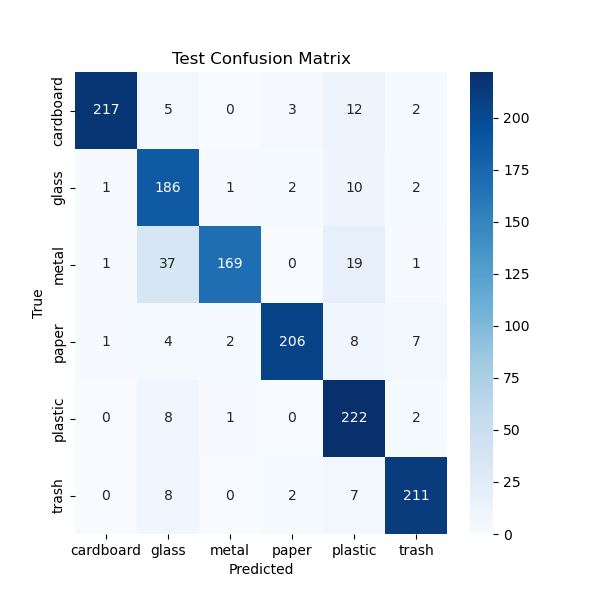
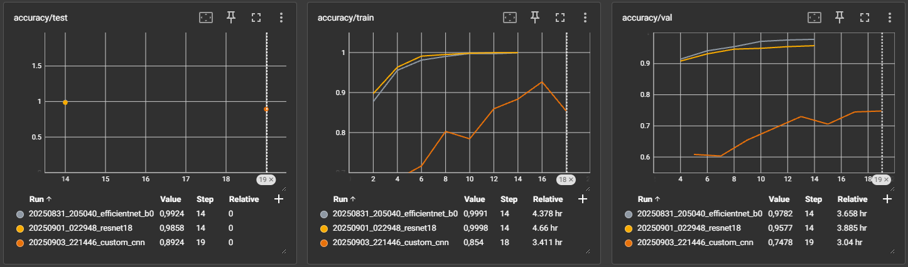
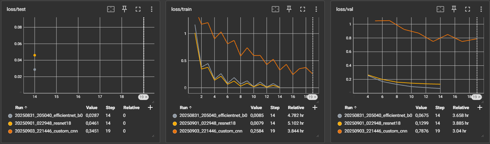

# Progetto di Classificazione dei Materiali Riciclabili

## 1. Introduzione
Il progetto si propone di classificare rifiuti in sei categorie (vetro, plastica, cartone, metallo, carta e rifiuti generici) per supportare sistemi di riciclo intelligente.  
Si sfruttano reti neurali pre-addestrate (ResNet-18 ed EfficientNet-B0) con strategie di data augmentation mirata per affrontare lo squilibrio tra le classi.  
L'obiettivo è ottenere un modello preciso e stabile, capace di generalizzare anche su classi meno rappresentate, con applicazioni dirette nella gestione automatizzata dei rifiuti.  

## 2. Dataset
- **Nome:** Garbage Image Dataset
- **Link:** [Kaggle](https://www.kaggle.com/datasets/farzadnekouei/trash-type-image-dataset)

### 2.1 Classi e campioni
| Classe           | Numero di immagini |
|-----------------|------------------|
| Vetro            | 501              |
| Metallo          | 410              |
| Carta            | 594              |
| Plastica         | 482              |
| Rifiuti Generici | 137              |
| **Totale**       | **2527**         |

### 2.2 Bilanciamento e criticità
Analizzando il dataset, si nota uno squilibrio tra le classi:  
- La classe "Rifiuti generici" ha solo 137 immagini, molto meno delle altre classi (ad esempio "Carta" con 594 immagini).  
- Questo squilibrio può portare a un modello che predilige le classi più grandi.

### 2.3 Distribuzione

    

    
Originale

    
    

    

    
Dopo Augmentation (min=3, max=10)

    
    

### 2.4 Data Augmentation e Bilanciamento delle Classi

Per gestire lo squilibrio del dataset e migliorare l'apprendimento delle classi minoritarie (in particolare "Rifiuti generici"), il progetto applica una **data augmentation mirata** combinata a un campionamento pesato dei batch.

- **Trasformazioni:** crop casuale, flip orizzontale e verticale, rotazioni, jitter di colore, conversione casuale in scala di grigi e blur gaussiano.
 
- **Repliche per classe:** ogni classe riceve un numero minimo (`min_aug`) e massimo (`max_aug`) di immagini generate, scalato linearmente tra min e max per le classi intermedie; le classi minoritarie arrivano fino a `max_aug`, le maggioritarie solo a `min_aug`.  

- **Batch bilanciati:** i batch sono campionati tramite `WeightedRandomSampler` con peso inverso alla frequenza della classe, garantendo rappresentanza equilibrata.

- **Riproducibilità:** un seed fisso viene impostato all'inizio dell'esperimento. Questo assicura che lo split train/validation/test sia sempre identico tra esecuzioni e che la generazione dei batch tramite `WeightedRandomSampler` sia coerente. Le trasformazioni di data augmentation, pur essendo casuali, sono riproducibili quando applicate usando generatori PyTorch configurati con lo stesso seed, garantendo esperimenti confrontabili e replicabili tra run differenti.

> Per dettagli di implementazione, vedere `AugmentationRunner` e `DataLoaderManager`.

#### Caricamento e preparazione dei dati
- I dataset vengono caricati tramite `ImageFolder` di torchvision, con trasformazioni standard (resize a 224x224, normalizzazione).  
- Il dataset viene diviso in **train, validation e test** secondo le proporzioni definite nella configurazione.

## 3. Architetture e Modelli
### 3.1 Motivazione della scelta dei modelli

Per questo progetto sono stati selezionati due modelli pre-addestrati noti per la classificazione di immagini:

- **ResNet-18**: modello leggero e stabile, adatto a dataset di dimensioni moderate. La struttura residuale permette un addestramento più semplice e rapido, rendendolo ideale per un approccio di fine-tuning sull'ultimo layer.

- **EfficientNet-B0**: modello efficiente che bilancia accuratezza e numero di parametri. Permette di ottenere buoni risultati anche con risorse computazionali limitate e dataset di piccole dimensioni.

- **CustomCNN (v1, v2, v3)**: architettura progettata e addestrata da zero, sviluppata in tre versioni progressive.
    - v1 rete con 3 blocchi conv+pool, adaptive pooling e due fully connected con dropout per la classificazione.
    - v2 rete con 4 blocchi conv+BN+pool, adaptive pooling e tre fully connected con batch norm e dropout.
    - v3 rete con 6 blocchi conv+BN+pool, adaptive pooling e tre fully connected con batch norm e dropout per classificazione.

I modelli ResNet-18 ed EfficientNet-B0 sono stati scelti per la loro efficienza e adattabilità a dataset di dimensioni moderate, permettendo di sperimentare senza sovraccaricare il sistema o dover addestrare reti molto profonde. Le tre varianti della CustomCNN (v1, v2, v3), invece, sono state sviluppate da zero per osservare l’effetto dell’aumento della complessità architetturale e confrontare direttamente un modello progettato ad hoc con reti pre-addestrate.

### 4.1 Setup preliminare

- **Modelli utilizzati:** ResNet-18 e EfficientNet-B0 pre-addestrati su ImageNet.  
- **Ultimo layer modificato:** Sostituito per adattarsi al numero di classi del dataset (6).  
- **Batch size, learning rate, epoche:** Valori iniziali scelti in base a impostazioni di riferimento per modelli pre-addestrati.
- **Preprocessing standard:** Resize a 224x224 e normalizzazione dei canali RGB.  
- **Ottimizzatore e scheduler:** Utilizziamo SGD con momentum 0,9 e weight decay per aggiornare i pesi della rete, combinato con lo scheduler ReduceLROnPlateau che riduce automaticamente il learning rate quando la metrica di validazione smette di migliorare, permettendo al modello di convergere in modo più stabile e preciso.  
- **Early stopping:** Il modello salva il best model solo se la loss di validazione migliora di almeno un valore minimo (`improvement_rate`), fermando il training quando il miglioramento non si verifica per un numero definito di epoche (`patience`).  
- **Accuracy target**: Il training viene interrotto anche se sia train che validation raggiungono la soglia di accuratezza desiderata (`accuracy_target`).
- **Monitoraggio distribuzione classi:** Durante il training viene registrata la distribuzione cumulativa delle classi per controllare eventuali sbilanciamenti.  
- **Riproducibilità:** Tutte le operazioni casuali sono controllate da un seed fisso (vedi paragrafo 2.4).  
- **Checkpointing:** Salvataggio completo di modello, optimizer, scheduler, metriche e parametri principali, permettendo di riprendere il training senza incongruenze tra configurazione e checkpoint.

### 4.2 Flow sperimentale

Ogni modello è stato addestrato più volte variando principalmente le strategie di data augmentation, per valutarne l'impatto sulle performance e sull'equilibrio tra classi.  
Per efficienza, alcune metriche sul train set vengono calcolate in modalità "light" ogni `accuracy_eval_every` epoche, mentre la validazione completa viene eseguita secondo la frequenza definita (`loss_eval_every`).  
Questi controlli permettono di monitorare accuratamente l'apprendimento senza rallentare eccessivamente il training.

**Parametri costanti per tutti i run:**  
- Batch size: 16  
- Momentum: 0,9  
- Augmentation Copy Original: True  

| Run ID | Learning Rate | Scheduler Patience | LR Scheduler Gamma | Weight Decay | Aug Min Copy | Aug Max Copy | Epoche | Epoche Effettive /Note |
|--------|---------------|------------------|------------------|--------------|--------------|--------------|--------|------------------------|
| 20250829_183356_efficientnet_b0 | 0,0005 | 2 | 0,5 | 0,005 | 3 | 6  | 20 | 11 – Target accuracy raggiunta |
| 20250830_012035_efficientnet_b0 | 0,0005 | 2 | 0,5 | 0,005 | 3 | 7  | 20 | 9 – Target accuracy raggiunta |
| 20250830_110540_efficientnet_b0 | 0,0005 | 2 | 0,5 | 0,005 | 3 | 8  | 20 | 7 – Target accuracy raggiunta |
| 20250831_003029_efficientnet_b0 | 0,0005 | 2 | 0,5 | 0,005 | 3 | 8  | 9  | 9 – Raggiunto numero epoche |
| 20250831_092738_resnet18        | 0,0005 | 2 | 0,5 | 0,005 | 3 | 8  | 20 | Early stopping attivato 3/3 |
| 20250831_142932_resnet18        | 0,0004 | 2 | 0,4 | 0,01  | 3 | 8  | 20 | 10 – Interrotta manualmente |
| 20250831_205040_efficientnet_b0 | 0,0005 | 2 | 0,4 | 0,005 | 3 | 10 | 20 | 14 – Early stopping attivato 2/2 |
| 20250901_022948_resnet18        | 0,0002 | 1 | 0,3 | 0,02  | 3 | 10 | 15 | 14 – Early stopping attivato |
| 20250903_122035_custom_cnn      | 0,0005 | 2 | 0,4 | 0,005 | 3 | 10 | 20 | 9 – Interrotta Manualmente |
| 20250903_141723_custom_cnn      | 0,0005 | 2 | 0,4 | 0,005 | 3 | 10 | 20 | 13 – Early stopping attivato |
| 20250903_180658_custom_cnn      | 0,0005 | 2 | 0,4 | 0,005 | 3 | 10 | 20 | 20 |
| 20250903_221446_custom_cnn      | 0,0005 | 2 | 0,4 | 0,005 | 3 | 10 | 20 | 19 – Early stopping attivato |
| 20250904_110115_custom_cnn      | 0,001  | 2 | 0,7 | 0,001 | 3 | 10 | 30 | 13 – Early stopping attivato |

#### Punti chiave dei run
> - L'augmentation mirata migliora significativamente la classe "Rifiuti generici" e riduce il gap Train/Val.
> - EfficientNet-B0 è più stabile sulle classi minoritarie rispetto a ResNet18.
> - Pochi epoch o target accuracy troppo bassi possono peggiorare le performance (es. Run 1, 2, 3).
> - Modifiche mirate degli hyperparametri su ResNet18 migliorano marginalmente l'overfitting, ma non raggiungono le performance di EfficientNet ottimale.
> - La configurazione Run 7 (EfficientNet-B0, max augmentation=10) è la migliore in termini di accuratezza e stabilità tra classi.

### 4.3 Analisi Sequenziale dei Run

#### 1. EfficientNetB0 – Run 20250829_183356 (Setup iniziale)
- **Performance:** Val accuracy 95,9%, Test accuracy 98,4%, Train accuracy 99,5%.
- **Classi:** F1 medio-alto, ma classe Trash debole (Val precision 0,85, F1 0,93).
- **Gap Train/Val:** 3,5%, indicativo di leggero overfitting.
- **Interpretazione:** modello già performante, ma sbilanciato sulle classi minoritarie.
- **Ragionamento verso esperimento successivo:** aumentare il valore massimo di augmentation per migliorare l'apprendimento della classe Trash.
- **Nota:** interruzione anticipata dovuta a target accuracy troppo basso.

#### 2. EfficientNetB0 – Run 20250830_012035
- **Performance:** Val accuracy +0,4%, Test accuracy +0,2% rispetto al run precedente.
- **Classi:** Trash migliora in precisione (0,87) sul validation set, ma con recall molto alto (1,0), indicando squilibrio nella distribuzione di prediction/label. F1 più uniforme.
- **Interpretazione:** piccolo miglioramento complessivo e training stabile.
- **Ragionamento:** proseguire con incremento delle augmentazioni (da 7 a 8 copie) per consolidare la stabilità.
- **Nota:** interruzione anticipata dovuta a target accuracy troppo basso.

#### 3. EfficientNetB0 – Run 20250830_110540
- **Performance:** Val accuracy 95,4%, Test accuracy 97,3%. Peggioramento rispetto al run precedente.
- **Classi:** Trash ancora instabile (F1 test 0,95).
- **Interpretazione:**  
  - Potrebbe esserci un eccesso di augmentazione che degrada le performance, ma non è certo.  
  - È possibile che l'addestramento sia stato troppo breve per alcune classi.  
  - Classi ancora sbilanciate.
- **Ragionamento:** aumentare il numero di epoche per capire se il peggioramento dipende dal training breve e monitorare attentamente l'overfitting.
- **Nota:** interruzione anticipata dovuta a target accuracy troppo basso.

#### 4. EfficientNetB0 – Run 20250831_003029
- **Performance:** Val accuracy 96,6%, Test accuracy 98,4%; delta Train-Val diminuito rispetto ai run precedenti.
- **Classi:** F1 migliorata sia su test che su validation, in particolare per la classe Trash.
- **Interpretazione:** l'aumento della target accuracy per evitare interruzioni premature si è rivelato efficace; l'addestramento risulta già stabile e bilanciato.
- **Ragionamento:** valutare un nuovo modello (ResNet18) per confrontare le performance su architetture alternative.

#### 5. ResNet18 – Run 20250831_092738
- **Performance:** Train accuracy 100%, Val accuracy 95,7%, Test accuracy 99,0%.
- **Gap Train/Val:** 4,3%, leggero overfitting.
- **Classi:** la classe Plastic (0,9296) e Glass (0,9435) presentano le performance più basse sul validation set; il gap con il test indica leggero overfitting e possibile instabilità nella generalizzazione.
- **Interpretazione:** modello veloce nell'apprendere, ma fragile in generalizzazione.
- **Ragionamento:** modificare hyperparametri (learning rate, weight decay) per contenere l'overfitting.

#### 6. ResNet18 – Run 20250831_142932
- **Performance:** Val accuracy 95,2%, con gap 4,8% a epoca 11.
- **Interpretazione:** la modifica dei parametri non è stata sufficiente; ResNet18 resta instabile sulle classi minoritarie e overfitta.
- **Ragionamento:** tornare a EfficientNetB0 aumentando ulteriormente i parametri di augmentation massima.

#### 7. EfficientNetB0 – Run 20250831_205040
- **Performance:** Val accuracy 97,8% (massimo), Test accuracy 99,2% (massimo).
- **Classi:** tutte le classi solide; Trash stabile (Val F1 0,98, Test F1 0,99).
- **Gap Train/Val:** minimo (2,1%), indicativo di basso overfitting.
- **Interpretazione:** configurazione vincente; l'aumento dell'augmentation Max a 10 ha migliorato il bilanciamento del dataset, favorendo l'apprendimento uniforme delle classi minoritarie.
- **Ragionamento:** dati i buoni risultati, si prova la stessa augmentation con ResNet18, rallentando l'apprendimento per contenere l'overfitting.

#### 8. ResNet18 – Run 20250901_022948
- **Performance:** Val accuracy 95,8%, Test accuracy 98,6%.
- **Classi:** F1 score leggermente migliorati rispetto ai precedenti run ResNet, ma non al livello di EfficientNetB0.
- **Gap Train/Val:** ancora elevato (4,2%), segnale di overfitting.
- **Interpretazione:** miglioramento marginale rispetto ai precedenti run ResNet, ma le performance rimangono inferiori all'EfficientNetB0 migliore.
- **Ragionamento:** conclusione della serie sperimentale, confermando che ResNet18 non raggiunge la stabilità e la generalizzazione del modello EfficientNet ottimale.

#### 9. Custom CNN – Run 20250903_122035 (v1)

- **Performance**: dati mancanti (n/a).
- **Classi**: impossibile valutare, run interrotta manualmente.
- **Interpretazione**: loss iniziale molto alta, modello non convergeva.
- **Ragionamento**: modifica della rete necessaria prima di proseguire (passaggio a v2).

#### 10. Custom CNN – Run 20250903_141723 (v2)

- **Performance**: Val F1 medio 0,71, Test F1 medio 0,76.
- **Classi**: Trash e Paper deboli su validation, Plastic con recall basso (Val 0,60).
- **Interpretazione**: modello inizia a generalizzare, ma alcune classi minoritarie restano instabili.
- **Ragionamento**: cambiare strategia di augmentation, integrando un undersampling delle classi più rappresentate dopo aver augumentato le classi meno rappresentate, per ridurre il gap e bilanciare meglio il dataset.

#### 11. Custom CNN – Run 20250903_180658 (v2 con augmentation modificata)

- **Performance**: Val F1 medio 0,71, Test F1 medio 0,79.
- **Classi**: alcune classi mostrano miglioramento sul test.
- **Interpretazione**: la Train Loss è migliorata significativamente (0,806 → 0,596), indicando che il modello apprende meglio i dati di training; la Val Loss resta alta (0,796), segnalando margine di miglioramento nella generalizzazione.
- **Ragionamento**: per i run successivi si prevede di potenziare la rete passando a v3 (6 blocchi conv + BN + pool), mantenendo invariata l’augmentation, per aumentare la capacità della rete e ottenere una generalizzazione migliore.

#### 12. Custom CNN – Run 20250903_221446 (v3)

- **Performance**: Val F1 medio 0,74, Test F1 medio 0,89.
- **Classi**: Plastic e Paper mostrano miglioramenti significativi sul test, Trash rimane stabile e alto; Metal e Glass più variabili su validation, ma con buona generalizzazione sul test.
- **Interpretazione**: il passaggio a v3 (6 blocchi conv + BN + pool) aumenta la capacità della rete e migliora la generalizzazione, come evidenziato dal consistente aumento del Test F1. Val F1 più basso indica che alcune classi restano ancora più difficili da apprendere.
- **Ragionamento**: per il run successivo si aumentano learning rate (0,0005 → 0,001) e batch size (da valore precedente a 32, per stabilizzare meglio l’ottimizzazione), si rende più aggressivo lo scheduler (gamma 0,4 → 0,7), si riduce il weight decay (0,005 → 0,001) e si estendono le epoche massime (20 → 30), con l’obiettivo di migliorare la convergenza, stabilizzare le classi deboli e sfruttare al meglio la maggiore capacità della rete v3.

#### 13. Custom CNN – Run 20250904_110115 (v3 con iperparametri modificati)

- **Performance**: F1 medio su validation 0,71, su test 0,82; overfitting evidente dal gap tra train e validation accuracy.
- **Classi**: Cardboard e Trash recall alti; Plastic molto debole su validation; Glass e altre classi minoritarie instabili.
- **Interpretazione**: Le modifiche agli iperparametri migliorano alcune classi più facili da distinguere, ma il modello fatica ugualmente a generalizzare.
- **Nota training**: l’early stopping è scattato molto presto (epoca 13), interrompendo l’allenamento per mancanza di miglioramenti; forse sarebbe stato meglio aumentare la pazienza per dare più margine al modello.

### 4.4 Log e monitoraggio
Durante l'addestramento, le metriche principali (loss, accuracy e metriche per classe) sono state monitorate tramite TensorBoard.  
Questo monitoraggio permette di analizzare i trend tra train e validation, identificando tempestivamente segnali di overfitting, underfitting o squilibri nell'apprendimento delle classi.

### 4.5 Testing finale

La valutazione finale dei modelli è gestita dalla classe `Tester`, che utilizza le stesse metriche calcolate durante training e validazione per garantire coerenza nei confronti delle analisi precedenti.  

Il test viene normalmente eseguito solo alla fine dell'addestramento, se il parametro di configurazione `final_test` è impostato a `True`. In alternativa, è possibile eseguire il test in un secondo momento caricando un modello salvato (checkpoint), senza dover rifare l'intero training.  

Questa fase fornisce una valutazione finale della capacità del modello di generalizzare su dati non utilizzati durante training e validazione.

## 5. Risultati
### 5.1 Metriche di Addestramento e Validazione per Run

| Run                             | Train Loss | Val Loss | Test Loss | Train Accuracy | Val Accuracy | Test Accuracy | Gap Train-Val | Gap Loss Val-Train |
|---------------------------------|-----------|---------|-----------|----------------|-------------|---------------|---------------|--------|
| 20250829_183356_efficientnet_b0 | 0,0251    | 0,1311  | 0,061     | 99,5%          | 95,9%       | 98,4%         | 3,5%          | 0,106  |
| 20250830_012035_efficientnet_b0 | 0,0388    | 0,1175  | 0,0611    | 99,3%          | 96,3%       | 98,6%         | 3,0%          | 0,0787 |
| 20250830_110540_efficientnet_b0 | 0,0632    | 0,1554  | 0,0949    | 98,5%          | 95,4%       | 97,3%         | 3,1%          | 0,0922 |
| 20250831_003029_efficientnet_b0 | 0,0364    | 0,1212  | 0,0647    | 99,4%          | 96,6%       | 98,4%         | 2,8%          | 0,0848 |
| 20250831_092738_resnet18        | 0,0023    | 0,1244  | 0,0342    | 100,0%         | 95,7%       | 99,0%         | 4,3%          | 0,122  |
| 20250831_142932_resnet18        | 0,0066    | 0,1536  | n/a       | 100,0%         | 95,2%       | n/a           | 4,8%          | 0,147  |
| 20250831_205040_efficientnet_b0 | 0,0085    | 0,0675  | 0,0287    | 99,9%          | 97,8%       | 99,2%         | 2,1%          | 0,059  |
| 20250901_022948_resnet18        | 0,0079    | 0,1299  | 0,0461    | 100,0%         | 95,8%       | 98,6%         | 4,2%          | 0,122  |
| 20250903_122035_custom_cnn      | 1,11      | 1,101   | n/a       | 59,0%          | 58,8%       | n/a           | 0,2%          | -0,009 |
| 20250903_141723_custom_cnn      | 0,8062    | 0,8013  | 0,6959    | 80,4%          | 71,2%       | 75,8%         | 9,2%          | -0,0049|
| 20250903_180658_custom_cnn      | 0,5963    | 0,7958  | 0,6135    | 81,0%          | 71,3%       | 79,2%         | 9,7%          | 0,1995 |
| 20250903_221446_custom_cnn      | 0,2584    | 0,7876  | 0,3451    | 85,4%          | 74,8%       | 89,2%         | 10,6%         | 0,5292 |
| 20250904_110115_custom_cnn      | 0,4079    | 0,8175  | 0,5147    | 84,0%          | 71,8%       | 82,8%         | 12,2%         | 0,4096 |

### 5.2 Precision per Classe per Run

| Run | Val Cardboard | Val Plastic | Val Metal | Val Paper | Val Glass | Val Trash | Test Cardboard | Test Plastic | Test Metal | Test Paper | Test Glass | Test Trash |
|-|-|-|-|-|-|-|-|-|-|-|-|-|
| 1 | 0,9864 | 0,9721 | 0,9688 | 0,9516 | 0,9708 | 0,8544 | 0,997  | 0,9891 | 0,9887 | 0,9875 | 0,9822 | 0,9275 |
| 2 | 0,9799 | 0,9651 | 0,9614 | 0,9887 | 0,9653 | 0,8743 | 0,9863 | 0,9887 | 0,9868 | 0,9889 | 0,9838 | 0,9815 |
| 3 | 0,9776 | 0,9503 | 0,9435 | 0,9817 | 0,9624 | 0,8839 | 0,9859 | 0,9775 | 0,9708 | 0,9858 | 0,973  | 0,9204 |
| 4 | 0,9915 | 0,9585 | 0,9715 | 0,9764 | 0,9439 | 0,9505 | 1      | 0,9809 | 0,9785 | 0,9836 | 0,9784 | 0,984  |
| 5 | 0,9803 | 0,9296 | 0,9596 | 0,9685 | 0,9435 | 0,9645 | 1      | 0,9972 | 0,9841 | 0,9864 | 0,989  | 0,9788 |
| 6 | n/a    | n/a    | n/a    | n/a    | n/a    | n/a    | n/a    | n/a    | n/a    | n/a    | n/a    | n/a    |
| 7 | 0,9862 | 0,9855 | 0,9734 | 0,9775 | 0,9743 | 0,9664 | 0,9909 | 0,9955 | 0,9906 | 0,9911 | 0,9973 | 0,9866 |
| 8 | 0,9791 | 0,9571 | 0,9475 | 0,9824 | 0,9365 | 0,9375 | 0,9909 | 0,9866 | 0,9882 | 0,994  | 0,9867 | 0,9563 |
| 9 | n/a    | n/a    | n/a    | n/a    | n/a    | n/a    | n/a    | n/a    | n/a    | n/a    | n/a    | n/a    |
| 10 | 0,8986 | 0,7236 | 0,8339 | 0,5647 | 0,7372 | 0,6159 | 0,9276 | 0,8212 | 0,8576 | 0,5833 | 0,8208 | 0,6246 |
| 11 | 0,7164 | 0,6168 | 0,7486 | 0,7312 | 0,7661 | 0,7395 | 0,8141 | 0,6981 | 0,8721 | 0,7719 | 0,7697 | 0,8571 |
| 12 | 0,9444 | 0,6523 | 0,838  | 0,8478 | 0,6031 | 0,7851 | 0,9864 | 0,7986 | 0,9769 | 0,9671 | 0,75   | 0,9378 |
| 13 | 0,7103 | 0,9239 | 0,7136 | 0,6952 | 0,6888 | 0,7093 | 0,7952 | 0,9746 | 0,8705 | 0,8063 | 0,7808 | 0,824  |

### 5.3 F1 per Classe per Run

| Run | Val Cardboard | Val Plastic | Val Metal | Val Paper | Val Glass | Val Trash | Test Cardboard | Test Plastic | Test Metal | Test Paper | Test Glass | Test Trash |
|-|-|-|-|-|-|-|-|-|-|-|-|-|
| 1 | 0,9797 | 0,9534 | 0,9654 | 0,9478 | 0,9708 | 0,9215 | 0,9925 | 0,981 | 0,9873 | 0,9814 | 0,9881 | 0,9624  |
| 2 | 0,9828 | 0,9562 | 0,9668 | 0,9655 | 0,9602 | 0,9329 | 0,989 | 0,9859 | 0,9907 | 0,9821 | 0,9838 | 0,9876  |
| 3 | 0,9762 | 0,9273 | 0,9600 | 0,9583 | 0,9534 | 0,9384 | 0,9859 | 0,9627 | 0,9773 | 0,9707 | 0,9769 | 0,9536 |
| 4 | 0,9860 | 0,9570 | 0,9628 | 0,9693 | 0,9598 | 0,9600 | 0,9943 | 0,9795 | 0,9785 | 0,9863 | 0,9824 | 0,9840 |
| 5 | 0,9762 | 0,9337 | 0,9632 | 0,9755 | 0,9348 | 0,9620 | 0,9957 | 0,9890 | 0,9907 | 0,9932 | 0,9850 | 0,9840 |
| 6 | n/a    | n/a    | n/a    | n/a    | n/a    | n/a    | n/a    | n/a    | n/a    | n/a    | n/a    | n/a    |
| 7 | 0,9907 | 0,9727 | 0,9805 | 0,9720 | 0,9730 | 0,9787 | 0,9943 | 0,9922 | 0,9941 | 0,9882 | 0,9920 | 0,9933 |
| 8 | 0,9803 | 0,9504 | 0,9601 | 0,9571 | 0,9413 | 0,9534 | 0,9920 | 0,9855 | 0,9893 | 0,9852 | 0,9827 | 0,9733 |
| 9 | n/a    | n/a    | n/a    | n/a    | n/a    | n/a    | n/a    | n/a    | n/a    | n/a    | n/a    | n/a    |
| 10 | 0,8252 | 0,6538 | 0,7161 | 0,7044 | 0,6553 | 0,7093 | 0,8543 | 0,7707 | 0,725 | 0,722 | 0,7358  | 0,7283 |
| 11 | 0,7665 | 0,6667 | 0,6633 | 0,7856 | 0,6437 | 0,7378 | 0,8622 | 0,743 | 0,7519 | 0,8269 | 0,7211 | 0,8219 |
| 12 | 0,8232 | 0,7364 | 0,6575 | 0,7761 | 0,6942 | 0,8063 | 0,9455 | 0,8689 | 0,845 | 0,9342 | 0,8267 | 0,9316 |
| 13 | 0,7878 | 0,5231 | 0,6901 | 0,768 | 0,696 | 0,7722 | 0,8759 | 0,6553 | 0,8647 | 0,8482 | 0,8124  | 0,8619 |

**Nota**: Run 6 e 9 interrotti manualmente prima del completamento; pertanto le metriche di test non sono disponibili (n/a).

### 5.4 Confusion matrix (modelli migliori)

Confusion Matrix 20250831_205040_efficientnet_b0:
    

    
    
    

Confusion Matrix 20250901_022948_resnet18:
    

    
    
    

Confusion Matrix 20250903_221446_custom_cnn:
    

    
    
    

#### Confronto Accuracy per classe (Test)

| Classe             | EfficientNet     | ResNet18       | Custom CNN      | Note |
|-------------------|-----------------|----------------|----------------|---------------------------------|
| Cartone           | 436/437 ≈ 99,8% | 434/437 ≈ 99,3% | 217/239 ≈ 90,8% | Entrambi eccellenti, Custom più basso |
| Vetro             | 373/378 ≈ 98,7% | 370/378 ≈ 97,9% | 186/202 ≈ 92,1% | EfficientNet leggermente migliore |
| Metallo           | 421/422 ≈ 99,8% | 418/422 ≈ 99,0% | 169/227 ≈ 74,4% | EfficientNet molto migliore |
| Carta             | 335/340 ≈ 98,5% | 332/340 ≈ 97,6% | 206/228 ≈ 90,4% | EfficientNet migliore |
| Plastica          | 444/449 ≈ 98,9% | 442/449 ≈ 98,4% | 222/233 ≈ 95,2% | EfficientNet migliore |
| Rifiuti generici  | 221/221 = 100%  | 219/221 ≈ 99,1% | 211/228 ≈ 92,6% | EfficientNet perfetto |

### 5.5 Accuracy e Loss

    
    

## 6. Analisi e Discussione

**Interpretazione dei risultati:**  
EfficientNet-B0 e ResNet-18 hanno mostrato performance elevate, con EfficientNet-B0 più stabile sulle classi minoritarie. La Custom CNN, pur essendo più semplice e addestrata da zero, mostra buone performance su alcune classi come Plastica, Carta e Cartone, ma è sensibilmente inferiore su Metallo e Rifiuti generici rispetto ai modelli pre-addestrati. L’analisi della confusion matrix evidenzia come EfficientNet-B0 commetta pochi errori anche tra classi visivamente simili (vetro e plastica), mentre ResNet-18 mostra una leggera difficoltà in queste discriminazioni. L’augmentation mirata ha migliorato significativamente le prestazioni della classe "Rifiuti generici", riducendo il gap tra train e validation e aumentando l’F1 score.

**Limiti del dataset:**  
Il dataset rimane piccolo e inizialmente sbilanciato; lo split casuale del test set può influenzare le metriche sulle classi meno rappresentate, portando a precisione e F1 più basse per queste classi. Nell'ultimo esperimento della Custom CNN, grazie all'undersampling, le classi sono state bilanciate, riducendo l’impatto negativo sulle metriche delle classi minoritarie.

**Possibili miglioramenti:** 
Ampliare il dataset con immagini reali o dati sintetici e testare su test set stratificati. Valutare ensemble di modelli o addestrare più layer dei modelli pre-addestrati. Per la Custom CNN, migliorare l’architettura o aggiungere più dati potrebbe ridurre il gap con EfficientNet-B0.

**Confronto con risultati attesi:**  
Nonostante il dataset sia di dimensioni moderate e i modelli relativamente semplici, un uso attento dell’augmentation e un bilanciamento corretto delle classi hanno permesso di ottenere risultati molto buoni, ...EfficientNet-B0 e ResNet-18 mostrano performance elevate e consistenti su tutte le classi, mentre la Custom CNN presenta performance inferiori e meno equilibrate tra le classi.

## 7. Conclusioni
Il progetto ha raggiunto un'accuracy del 99,2% sul test set con EfficientNet-B0, con un gap tra train e validation di soli 2,1%, confermando l’efficacia dell’approccio sperimentale. EfficientNet-B0 si è dimostrato il modello più stabile sulle classi difficili, mentre ResNet-18 mantiene buone performance generali. La Custom CNN ha raggiunto 89,2% di accuracy, ma le performance non sono equilibrate tra le classi.

Nonostante le dimensioni moderate del dataset, i risultati mostrano che una gestione attenta delle metriche e della scelta dei modelli permette di ottenere prestazioni elevate.

## 8. Allegati
- Codice sorgente e struttura cartelle (con README per esecuzione)
- Modelli salvati (Best EfficientNet-B0, Best ResNet-18, Custom-CNN)
- logs
- TensorBoard per monitoraggio di loss, accuracy e metriche per classe
- `environment.yaml` per replicabilità dell'ambiente Python

